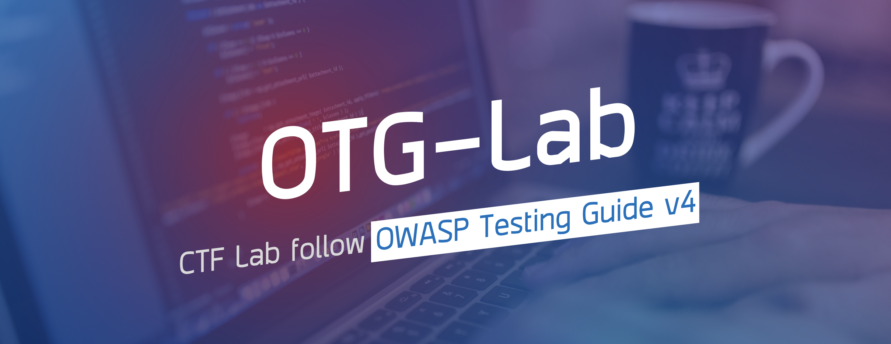

<h1 align="center">
   
  
   
</h1>
<h4 align="center">OTG-Lab - CTF Lab follow OWASP Testing Guide v4</h4>

## introduction

`OTG-Lab` is a lab for beginners that need to practice to perform Web Application Penetration Testing with CTF style, follow [OTGv4](https://www.owasp.org/index.php/OWASP_Testing_Guide_v4_Table_of_Contents). Almost all the labs can launch by docker.

## Contribution

Your contributions and suggestions are welcome.

## License

This work is licensed under a [Creative Commons Attribution 4.0 International License](http://creativecommons.org/licenses/by/4.0/)
